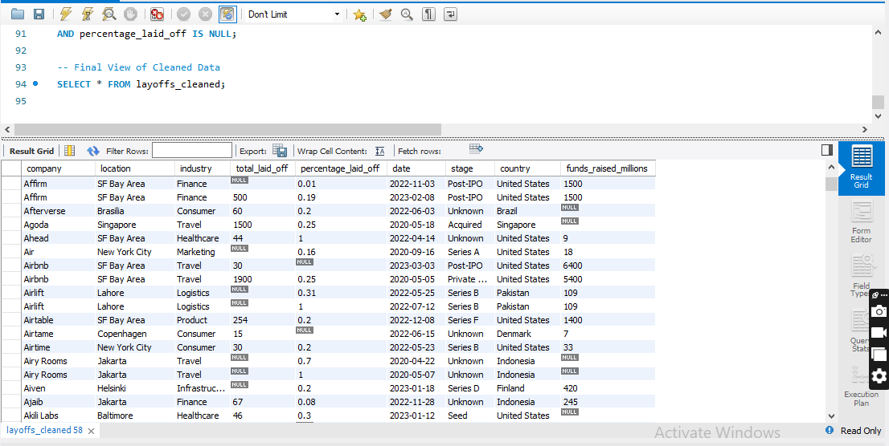

# World Layoffs Data Cleaning Project 📊

## Overview
This project focuses on cleaning a raw dataset of world layoffs to make it ready for exploratory data analysis. The data was messy, containing duplicates, inconsistent formatting, and missing values.

## Dataset
- **Source:** Kaggle / Alex The Analyst
- **Tools:** MySQL Workbench

## Key Cleaning Steps
1. **Removed Duplicates:** Used `ROW_NUMBER()` and CTEs to identify and delete identical rows.
2. **Standardization:** Fixed industry names (e.g., 'Crypto'), trimmed whitespace, and cleaned country names.
3. **Date Formatting:** Converted string dates to `YYYY-MM-DD` format using `STR_TO_DATE`.
4. **Handling Nulls:** Used **Self-Joins** to populate missing industry data based on existing company records.
5. **Schema Optimization:** Altered table structures and dropped helper columns like `row_num`.

## Skills Demonstrated
- Complex Joins & Self-Joins
- Window Functions (`OVER`, `PARTITION BY`)
- Common Table Expressions (CTEs)
- Data Definition Language (DDL) & Data Manipulation Language (DML)

